# 🛡️ Awesome Merchant Risk Platform

<p align="left">
  <a href="https://github.com/ishandutta2007/Awesome-Awesome-Awesome"></a><a href="https://discord.gg/jc4xtF58Ve"></a>
  <a href="https://github.com/ishandutta2007/Awesome-Merchant-Risk-Platform/stargazers"></a>
  <a href="https://github.com/ishandutta2007/Awesome-Merchant-Risk-Platform/network/members"></a>
  <a href="https://github.com/ishandutta2007/Awesome-Merchant-Risk-Platform/blob/main/LICENSE"></a>
  <a href="https://github.com/ishandutta2007"></a>
</p>



---

## 📌 Executive Overview & Ecosystem Architecture

Welcome to the definitive, curated ecosystem guide for **Merchant Risk Platforms**, **E-Commerce Fraud Prevention Systems**, **Transaction Monitoring Engines**, **Identity Risk Decisioning**, and **AML Compliance Infrastructure**.

Modern digital merchants, payment service providers (PSPs), fintechs, and marketplaces operate in an environment of increasing fraud velocity. Building or selecting a merchant risk platform requires orchestrating **device fingerprinting, behavioral biometrics, real-time velocity scoring, graph analytics, machine learning feature stores, policy engines, and case management**.

This repository details both **Commercial Hosted SaaS Platforms** and **Production-Grade Open-Source Building Blocks** required to architect end-to-end self-hosted risk engines.

---

## 📑 Table of Contents

- [🏢 Enterprise SaaS & Hosted Platforms](#-enterprise-saas--hosted-platforms)
- [💻 Open-Source GitHub Repositories (Sorted by Stars)](#-open-source-github-repositories-sorted-by-stars)
  - [🛡️ Open-Source Fraud & Risk Engines](#️-open-source-fraud--risk-engines)
  - [🧠 Fraud Detection & Machine Learning](#-fraud-detection--machine-learning)
  - [⚡ Feature Stores & Real-Time Risk Features](#-feature-stores--real-time-risk-features)
  - [📱 Device Intelligence & Behavioral Signals](#-device-intelligence--behavioral-signals)
  - [⚖️ Rules, Policy & Decision Engines](#️-rules-policy--decision-engines)
  - [🕸️ Graph Analytics & Entity Resolution](#️-graph-analytics--entity-resolution)
  - [🔎 AML, Transaction Monitoring & Case Management](#-aml-transaction-monitoring--case-management)
  - [🌊 Streaming & Real-Time Infrastructure](#-streaming--real-time-infrastructure)
  - [📊 Search, Analytics & Risk Operations](#-search-analytics--risk-operations)
  - [🤖 AI & LLM Infrastructure for Risk Ops](#-ai--llm-infrastructure-for-risk-ops)
- [🏗️ Recommended Self-Hosted Risk Architecture](#️-recommended-self-hosted-risk-architecture)
- [📈 Star History](#-star-history)
- [💖 Support & Community](#-support--community)

---

## 🏢 Enterprise SaaS & Hosted Platforms

> 📊 **Sector Market Size & Fragmentation Analysis:**
> The global **E-Commerce Fraud Prevention & Merchant Risk Platform Market** is estimated at **$25.5 Billion in 2026** (projected to reach **$150+ Billion by 2030** at a **15.2% CAGR**). The sector is **moderately fragmented**: while hundreds of niche point solutions exist, top enterprise platforms (LexisNexis, Experian, TransUnion, Socure, Forter, Signifyd, Sift) control over **55% of total market volume** due to proprietary global identity consortiums, chargeback guarantee models, and shared device networks.

| 🏢 Platform | 💡 Key Capabilities & Focus | 💰 Valuation / Revenue Size | 💳 Pricing (Starting Tier) | 🎁 Free Tier / Free Trial Limit |
| :--- | :--- | :--- | :--- | :--- |
| **[LexisNexis Risk Solutions](https://risk.lexisnexis.com/)** | ThreatMetrix digital identity, global device network, transaction risk scoring & sanctions screening. | **~$80.0B Market Cap** *(RELX Parent)* | $0.15 - $0.25 / query ($500/mo min contract) | 14-day sandbox developer trial with test credits |
| **[Experian Fraud & Identity](https://www.experian.com/business/solutions/fraud-and-identity)** | Identity validation, digital footprinting, step-up authentication & transaction risk scoring. | **~$35.0B Market Cap** | $0.20 / verification ($1,500/mo min spend) | 30-day developer sandbox (200 free API calls) |
| **[TransUnion TruValidate](https://www.transunion.com/product/truvalidate-fraud-and-identity-solutions)** | Consumer identity verification, device risk signals & automated risk policy controls. | **~$15.0B Market Cap** | $0.15 - $0.30 / check ($1,000/mo min contract) | 30-day developer sandbox (100 free verification checks) |
| **[Socure](https://www.socure.com/)** | Predictive document verification, synthetic identity fraud prevention & CIP/KYC onboarding. | **~$4.5B Valuation** | $0.25 / verification ($500/mo min spend) | 30-day developer sandbox ($100 free API credit) |
| **[Forter](https://www.forter.com/)** | Real-time identity decisioning, automated chargeback guarantee & promo/policy abuse protection. | **~$3.0B Valuation** | 0.3% - 0.6% / approved transaction ($1,000/mo min) | 14-day historical data audit & risk assessment trial |
| **[Signifyd](https://www.signifyd.com/)** | E-commerce commerce protection, payment fraud automation & 100% chargeback financial coverage. | **~$1.34B Valuation** | 0.5% - 1.0% / transaction (guaranteed) or $1,500/mo min | 14-day merchant evaluation trial |
| **[BioCatch](https://www.biocatch.com/)** | Behavioral biometrics, account takeover (ATO) prevention & continuous session risk profiling. | **~$1.30B Valuation** | $0.05 - $0.15 / active session ($2,000/mo base) | 30-day Proof-of-Concept (PoC) sandbox access |
| **[Feedzai](https://feedzai.com/)** | Enterprise risk operations, AI AML transaction monitoring & real-time financial crime scoring. | **~$1.00B Valuation** | $25,000 / year starter tier (~$2,083/mo) | 14-day interactive demo PoC environment |
| **[Sift](https://sift.com/)** | Digital trust platform covering payment fraud, ATO, content abuse & account verification. | **~$1.00B Valuation** | $0.05 / transaction ($500/mo starter plan) | 30-day free trial (up to 10,000 test transactions) |
| **[Ekata](https://ekata.com/)** | Global identity verification APIs, identity network signals & phone/email risk attributes. | **$850M Acquired** *(Mastercard)* | $0.08 / API query ($300/mo min commitment) | 14-day free trial (up to 500 free API queries) |
| **[Riskified](https://www.riskified.com/)** | Automated e-commerce payment decisioning, chargeback guarantee & payment approval optimization. | **~$800M Market Cap** *(NYSE: RSKD)* | 0.4% - 0.9% fee per approved transaction | 14-day risk assessment & historical transaction audit |
| **[Kount](https://kount.com/)** | Identity trust network, AI transaction risk decisioning & automated chargeback management. | **$640M Acquired** *(Equifax)* | $0.07 / transaction ($250/mo starter plan) | 14-day free trial (up to 2,500 transactions) |
| **[SEON](https://seon.io/)** | Digital footprinting, IP/email/phone analysis, transaction scoring & custom risk rules. | **~$500M Valuation** | $299 / month starter tier (includes 2,000 checks) | Free forever tier (up to 1,000 API checks/mo) |
| **[Sardine](https://www.sardine.ai/)** | Combined device intelligence, behavioral analytics, crypto/fiat risk & transaction monitoring. | **~$500M Valuation** | $0.10 / transaction ($250/mo base fee) | 14-day sandbox trial (5,000 test API calls) |
| **[HUMAN](https://www.humansecurity.com/)** | Bot management, credential stuffing defense, account protection & malicious automation blocking. | **~$500M Valuation** | $1,500 / month Bot Defender starter tier | 14-day threat intelligence audit trial |
| **[Arkose Labs](https://www.arkoselabs.com/)** | Bot mitigation, credential attack defense & enforcement challenges for account security. | **~$400M Valuation** | $2,500 / month enterprise base tier | 14-day bot attack assessment trial |
| **[DataVisor](https://www.datavisor.com/)** | Unsupervised ML anomaly detection, graph risk analysis & real-time transaction scoring. | **~$300M Valuation** | $1,000 / month cloud starter tier | 14-day free trial (up to 100k events processed) |
| **[Unit21](https://www.unit21.ai/)** | No-code transaction monitoring, AML compliance rules, case management & risk workflows. | **~$300M Valuation** | $1,200 / month starter subscription | 14-day sandbox access with sample data pipelines |
| **[Fraud.net](https://www.fraud.net/)** | AI-driven fraud risk scoring, collective network intelligence, rules engine & analyst dashboards. | **~$100M Valuation** | $299 / month starter plan (up to 5,000 trans/mo) | 14-day free trial (1,000 free API calls) |

---

## 💻 Open-Source GitHub Repositories (Sorted by Stars)

> 💡 **Note on Open Source:** While commercial SaaS solutions provide proprietary consortium data, the open-source projects below form the technical building blocks for **building a robust, self-hosted merchant risk engine**.

### 🛡️ Open-Source Fraud & Risk Engines

* **[ballerine-io/ballerine](https://github.com/ballerine-io/ballerine)** [](https://github.com/ballerine-io/ballerine/stargazers)

  Open-source infrastructure and data orchestration platform for merchant risk decisioning, KYC/KYB & compliance workflows.

* **[jube-home/aml-fraud-transaction-monitoring](https://github.com/jube-home/aml-fraud-transaction-monitoring)** [](https://github.com/jube-home/aml-fraud-transaction-monitoring/stargazers)

  Open-source AML & fraud detection platform with real-time transaction monitoring, rules, ML scoring & case management.

* **[AmirhosseinHonardoust/Financial-Fraud-Risk-Engine](https://github.com/AmirhosseinHonardoust/Financial-Fraud-Risk-Engine)** [](https://github.com/AmirhosseinHonardoust/Financial-Fraud-Risk-Engine/stargazers)

  End-to-end fraud risk pipeline featuring cost-sensitive ML, threshold optimization, SHAP explainability & analyst dashboard.

* **[OlawumiSalaam/fraud-detection-system](https://github.com/OlawumiSalaam/fraud-detection-system)** [](https://github.com/OlawumiSalaam/fraud-detection-system/stargazers)

  FastAPI & LightGBM real-time payment decisioning platform with audit logging & Streamlit visualization.

* **[opensyndicate/risk-triage](https://github.com/opensyndicate/risk-triage)** [](https://github.com/opensyndicate/risk-triage/stargazers)

  Payment risk scoring & fraud triage library providing weighted transaction signals, reason codes & advisory decisions.

* **[peralivet/fraud-detection-platform](https://github.com/peralivet/fraud-detection-platform)** [](https://github.com/peralivet/fraud-detection-platform/stargazers)

  Calibrated fraud modeling, cost-sensitive thresholding, risk bands & production batch scoring system.

### 🧠 Fraud Detection & Machine Learning

* **[tensorflow/tensorflow](https://github.com/tensorflow/tensorflow)** [](https://github.com/tensorflow/tensorflow/stargazers)

  End-to-end machine learning framework for deep anomaly detection and transaction risk scoring.

* **[pytorch/pytorch](https://github.com/pytorch/pytorch)** [](https://github.com/pytorch/pytorch/stargazers)

  Deep learning framework for sequence modeling, behavioral biometrics & graph neural network fraud detection.

* **[scikit-learn/scikit-learn](https://github.com/scikit-learn/scikit-learn)** [](https://github.com/scikit-learn/scikit-learn/stargazers)

  Machine learning toolkit for transaction classification, clustering, outlier detection & feature preprocessing.

* **[dmlc/xgboost](https://github.com/dmlc/xgboost)** [](https://github.com/dmlc/xgboost/stargazers)

  Scalable gradient boosting framework optimized for tabular transaction risk models.

* **[mlflow/mlflow](https://github.com/mlflow/mlflow)** [](https://github.com/mlflow/mlflow/stargazers)

  ML lifecycle platform for experiment tracking, model registry, evaluation & deployment in risk systems.

* **[shap/shap](https://github.com/shap/shap)** [](https://github.com/shap/shap/stargazers)

  Explainable-AI toolkit for feature-attribution explanations on individual transaction risk decisions.

* **[optuna/optuna](https://github.com/optuna/optuna)** [](https://github.com/optuna/optuna/stargazers)

  Hyperparameter optimization framework for tuning fraud risk decision thresholds & model parameters.

* **[marcotcr/lime](https://github.com/marcotcr/lime)** [](https://github.com/marcotcr/lime/stargazers)

  Explainable AI framework for local explanations of complex fraud model predictions.

* **[yzhao062/pyod](https://github.com/yzhao062/pyod)** [](https://github.com/yzhao062/pyod/stargazers)

  Python anomaly detection toolkit with 60+ algorithms for unusual payment, session & merchant behavior.

* **[catboost/catboost](https://github.com/catboost/catboost)** [](https://github.com/catboost/catboost/stargazers)

  Gradient boosting library tailored for categorical heavy merchant, user, device & IP signals.

* **[evidentlyai/evidently](https://github.com/evidentlyai/evidently)** [](https://github.com/evidentlyai/evidently/stargazers)

  ML observability framework for evaluating data drift, model performance degradation & feature anomalies.

* **[online-ml/river](https://github.com/online-ml/river)** [](https://github.com/online-ml/river/stargazers)

  Streaming online machine learning framework for continuously updating real-time fraud models.

* **[SeldonIO/alibi-detect](https://github.com/SeldonIO/alibi-detect)** [](https://github.com/SeldonIO/alibi-detect/stargazers)

  Algorithms for outlier, adversarial, concept drift & distribution-shift detection in production fraud pipelines.

### ⚡ Feature Stores & Real-Time Risk Features

* **[redis/redis](https://github.com/redis/redis)** [](https://github.com/redis/redis/stargazers)

  Ultra-low-latency in-memory data store for velocity counters, session state & real-time risk features.

* **[dragonflydb/dragonfly](https://github.com/dragonflydb/dragonfly)** [](https://github.com/dragonflydb/dragonfly/stargazers)

  High-throughput Redis-compatible in-memory store for real-time risk aggregations.

* **[apache/cassandra](https://github.com/apache/cassandra)** [](https://github.com/apache/cassandra/stargazers)

  Distributed NoSQL database built for high-volume transaction history & behavioral event streams.

* **[feast-dev/feast](https://github.com/feast-dev/feast)** [](https://github.com/feast-dev/feast/stargazers)

  Open-source feature store for point-in-time correct training & low-latency online fraud feature retrieval.

* **[logicalclocks/hopsworks](https://github.com/logicalclocks/hopsworks)** [](https://github.com/logicalclocks/hopsworks/stargazers)

  AI data platform with integrated feature store for enterprise fraud feature management.

### 📱 Device Intelligence & Behavioral Signals

* **[PostHog/posthog](https://github.com/PostHog/posthog)** [](https://github.com/PostHog/posthog/stargazers)

  Product analytics & event tracking engine for capturing behavioral signals and funnel anomalies.

* **[fingerprintjs/fingerprintjs](https://github.com/fingerprintjs/fingerprintjs)** [](https://github.com/fingerprintjs/fingerprintjs/stargazers)

  Browser fingerprinting library for generating client-side device identification signals.

* **[matomo-org/matomo](https://github.com/matomo-org/matomo)** [](https://github.com/matomo-org/matomo/stargazers)

  Privacy-focused analytics platform for tracking user sessions & suspicious behavior.

* **[openreplay/openreplay](https://github.com/openreplay/openreplay)** [](https://github.com/openreplay/openreplay/stargazers)

  Session replay and analytics platform for investigating suspicious user journeys & account abuse.

* **[open-telemetry/opentelemetry-collector](https://github.com/open-telemetry/opentelemetry-collector)** [](https://github.com/open-telemetry/opentelemetry-collector/stargazers)

  Observability telemetry framework for monitoring transaction processing pipelines.

### ⚖️ Rules, Policy & Decision Engines

* **[open-policy-agent/opa](https://github.com/open-policy-agent/opa)** [](https://github.com/open-policy-agent/opa/stargazers)

  General-purpose policy engine for transparent transaction rules, risk limits & review policies.

* **[j-easy/easy-rules](https://github.com/j-easy/easy-rules)** [](https://github.com/j-easy/easy-rules/stargazers)

  Lightweight Java rules engine for fast risk scoring prototyping.

* **[CacheControl/json-rules-engine](https://github.com/CacheControl/json-rules-engine)** [](https://github.com/CacheControl/json-rules-engine/stargazers)

  JSON-expressed rules engine for client/server risk rule execution.

* **[cedar-policy/cedar](https://github.com/cedar-policy/cedar)** [](https://github.com/cedar-policy/cedar/stargazers)

  Fast expressive policy language and authorization engine for fine-grained risk rules.

* **[NRules/NRules](https://github.com/NRules/NRules)** [](https://github.com/NRules/NRules/stargazers)

  Rete-based rules engine for .NET to execute configurable transaction policies.

### 🕸️ Graph Analytics & Entity Resolution

* **[pyg-team/pytorch_geometric](https://github.com/pyg-team/pytorch_geometric)** [](https://github.com/pyg-team/pytorch_geometric/stargazers)

  Graph neural network framework for fraud ring identification & relationship modeling.

* **[networkx/networkx](https://github.com/networkx/networkx)** [](https://github.com/networkx/networkx/stargazers)

  Python graph analysis library for investigating connected components & transaction networks.

* **[neo4j/neo4j](https://github.com/neo4j/neo4j)** [](https://github.com/neo4j/neo4j/stargazers)

  Graph database for modeling relationships between cards, IPs, devices, merchants & fraud rings.

* **[dmlc/dgl](https://github.com/dmlc/dgl)** [](https://github.com/dmlc/dgl/stargazers)

  Deep graph learning framework for entity risk scoring & graph-based fraud detection.

* **[apache/age](https://github.com/apache/age)** [](https://github.com/apache/age/stargazers)

  PostgreSQL extension providing graph database capabilities for transactional risk analysis.

* **[dedupeio/dedupe](https://github.com/dedupeio/dedupe)** [](https://github.com/dedupeio/dedupe/stargazers)

  Python library for fuzzy matching, record deduplication & entity resolution across risk datasets.

* **[moj-analytical-services/splink](https://github.com/moj-analytical-services/splink)** [](https://github.com/moj-analytical-services/splink/stargazers)

  Probabilistic record linkage framework for customer & merchant entity resolution.

* **[igraph/igraph](https://github.com/igraph/igraph)** [](https://github.com/igraph/igraph/stargazers)

  High-performance C/Python network analysis library for large-scale fraud network detection.

### 🔎 AML, Transaction Monitoring & Case Management

* **[opensearch-project/OpenSearch](https://github.com/opensearch-project/OpenSearch)** [](https://github.com/opensearch-project/OpenSearch/stargazers)

  Distributed search & analytics engine for transaction investigation & risk case management.

* **[MISP/MISP](https://github.com/MISP/MISP)** [](https://github.com/MISP/MISP/stargazers)

  Threat intelligence sharing platform for exchanging fraud indicators & risk signals.

* **[TheHive-Project/TheHive](https://github.com/TheHive-Project/TheHive)** [](https://github.com/TheHive-Project/TheHive/stargazers)

  Security incident & investigation case management platform adaptable to fraud operations.

* **[TheHive-Project/Cortex](https://github.com/TheHive-Project/Cortex)** [](https://github.com/TheHive-Project/Cortex/stargazers)

  Observable analysis engine for auto-enriching suspicious entities in fraud investigations.

* **[opensanctions/opensanctions](https://github.com/opensanctions/opensanctions)** [](https://github.com/opensanctions/opensanctions/stargazers)

  Open database of international sanctions, PEPs & high-risk entities for KYC/AML screening.

* **[mojaloop/mojaloop](https://github.com/mojaloop/mojaloop)** [](https://github.com/mojaloop/mojaloop/stargazers)

  Open payment interoperability platform for compliant transaction processing architectures.

### 🌊 Streaming & Real-Time Infrastructure

* **[apache/spark](https://github.com/apache/spark)** [](https://github.com/apache/spark/stargazers)

  Unified analytics engine for large-scale offline fraud feature extraction & model training.

* **[apache/kafka](https://github.com/apache/kafka)** [](https://github.com/apache/kafka/stargazers)

  Distributed event streaming backbone for transaction, login & chargeback event pipelines.

* **[apache/flink](https://github.com/apache/flink)** [](https://github.com/apache/flink/stargazers)

  Stateful stream processing engine for real-time velocity calculations & fraud window aggregations.

* **[temporalio/temporal](https://github.com/temporalio/temporal)** [](https://github.com/temporalio/temporal/stargazers)

  Durable execution engine for managing complex manual review & chargeback workflows.

* **[nats-io/nats-server](https://github.com/nats-io/nats-server)** [](https://github.com/nats-io/nats-server/stargazers)

  Ultra-lightweight messaging system for low-latency risk signal distribution.

* **[apache/pulsar](https://github.com/apache/pulsar)** [](https://github.com/apache/pulsar/stargazers)

  Distributed pub-sub messaging system for real-time event-driven risk architectures.

* **[rabbitmq/rabbitmq-server](https://github.com/rabbitmq/rabbitmq-server)** [](https://github.com/rabbitmq/rabbitmq-server/stargazers)

  Message broker for asynchronous fraud workflows, alert routing & case creation.

### 📊 Search, Analytics & Risk Operations

* **[grafana/grafana](https://github.com/grafana/grafana)** [](https://github.com/grafana/grafana/stargazers)

  Operational dashboards for monitoring fraud rates, review queues & decision metrics.

* **[apache/superset](https://github.com/apache/superset)** [](https://github.com/apache/superset/stargazers)

  Enterprise data exploration platform for building risk decisioning dashboards.

* **[ClickHouse/ClickHouse](https://github.com/ClickHouse/ClickHouse)** [](https://github.com/ClickHouse/ClickHouse/stargazers)

  Columnar OLAP database for fast analytical queries on massive transaction streams.

* **[metabase/metabase](https://github.com/metabase/metabase)** [](https://github.com/metabase/metabase/stargazers)

  Self-hosted BI tool for business analyst reporting on merchant risk metrics.

* **[duckdb/duckdb](https://github.com/duckdb/duckdb)** [](https://github.com/duckdb/duckdb/stargazers)

  In-process analytical SQL database for local fraud investigation & model prototyping.

* **[postgres/postgres](https://github.com/postgres/postgres)** [](https://github.com/postgres/postgres/stargazers)

  Relational database foundation for merchant profiles, transaction logs & decision audit trails.

### 🤖 AI & LLM Infrastructure for Risk Ops

* **[ollama/ollama](https://github.com/ollama/ollama)** [](https://github.com/ollama/ollama/stargazers)

  Local LLM runner for private fraud investigation assistants & case summaries.

* **[langchain-ai/langchain](https://github.com/langchain-ai/langchain)** [](https://github.com/langchain-ai/langchain/stargazers)

  Framework for developing LLM-powered risk decisioning & investigation tools.

* **[vllm-project/vllm](https://github.com/vllm-project/vllm)** [](https://github.com/vllm-project/vllm/stargazers)

  High-throughput LLM inference engine for self-hosted risk analysis services.

* **[BerriAI/litellm](https://github.com/BerriAI/litellm)** [](https://github.com/BerriAI/litellm/stargazers)

  Unified API gateway for connecting risk applications to 100+ LLM backends.

* **[run-llama/llama_index](https://github.com/run-llama/llama_index)** [](https://github.com/run-llama/llama_index/stargazers)

  Data framework for connecting risk documents & transaction histories to LLM agents.

* **[langchain-ai/langgraph](https://github.com/langchain-ai/langgraph)** [](https://github.com/langchain-ai/langgraph/stargazers)

  Stateful agentic framework for complex multi-step fraud investigation workflows.

* **[deepset-ai/haystack](https://github.com/deepset-ai/haystack)** [](https://github.com/deepset-ai/haystack/stargazers)

  Open-source RAG framework for querying compliance guidelines & fraud policy bases.

---

## 🏗️ Recommended Self-Hosted Risk Architecture

To build a full self-hosted alternative to SaaS platforms:

```
                  ┌─────────────────────────────────────────┐
                  │   E-Commerce / PSP Transaction Event   │
                  └────────────────────┬────────────────────┘
                                       │
                                       ▼
                  ┌─────────────────────────────────────────┐
                  │       FingerprintJS / Device Signals    │
                  └────────────────────┬────────────────────┘
                                       │
                                       ▼
                  ┌─────────────────────────────────────────┐
                  │     Apache Kafka (Ingestion Event)      │
                  └────────────────────┬────────────────────┘
                                       │
                   ┌───────────────────┴───────────────────┐
                   ▼                                       ▼
    ┌─────────────────────────────┐         ┌─────────────────────────────┐
    │  Apache Flink + Redis       │         │  Feast Feature Store        │
    │  Real-Time Velocity Signals │         │  Online Risk Features       │
    └──────────────┬──────────────┘         └──────────────┬──────────────┘
                   │                                       │
                   └───────────────────┬───────────────────┘
                                       │
                                       ▼
                  ┌─────────────────────────────────────────┐
                  │  Ballerine / Jube Risk Decision Engine  │
                  │  (XGBoost / LightGBM + OPA Rules)       │
                  └────────────────────┬────────────────────┘
                                       │
                ┌──────────────────────┼──────────────────────┐
                ▼                      ▼                      ▼
        [ Approve (Pass) ]     [ Flag for Review ]    [ Decline (Block) ]
                                       │
                                       ▼
                         ┌───────────────────────────┐
                         │ OpenSearch / Temporal     │
                         │ Analyst Review & Cases    │
                         └───────────────────────────┘
```

---

## 📈 Star History

[](https://star-history.dera.page/#ishandutta2007/Awesome-Merchant-Risk-Platform&type=date&legend=top-left)

---

## 💖 Support & Community

Thank you for exploring **Awesome Merchant Risk Platform**! If this repository helped you evaluate, build, or research fraud prevention solutions, please consider supporting the project:

- ⭐ **Star this repository** to help others discover it.
- 🔀 **Fork & Contribute** by submitting a Pull Request with new open-source risk tools or SaaS entries.
- 📢 **Share** with colleagues, engineering leads, and risk practitioners.
- ☕ **Buy me a coffee**: Support ongoing updates via [GitHub Sponsors](https://github.com/sponsors/ishandutta2007).

<a href="https://github.com/sponsors/ishandutta2007"></a>

---

*Maintainer:* [@ishandutta2007](https://github.com/ishandutta2007) | Curated with ❤️ for the global fraud engineering community.
